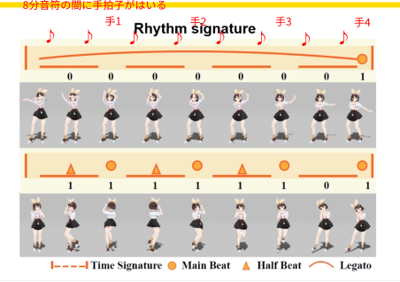

# memo

- めっちゃ勉強になりそう
- https://www.audiolabs-erlangen.de/resources/MIR/FMP/C0/C0.html

> Then we retrieve all musically meaningful phrases using the music segmentation and similarity labeling
method proposed by Serra et al [2012; 2014]. Similar bars within a
phrase are further detected (having spectrogram difference within a
small threshold) and given an identity ID.
- https://github.com/wayne391/sf_segmenter

## Rhythm Signature

次のように、1小説内の8分音符の終わりにkey frameがくるかどうかのイメージ. 
ハッピーシンセサイザーとか手をたたきながら眺めるとなんとなくわかってくる.

- ダンスのリズムのとり方  
https://www.youtube.com/watch?v=TSuj-ScZJYU  
https://www.youtube.com/watch?v=q4_QigqXXS4&t=241s
  どらえもんのやつわかりやすい

ハッピーシンセサイザーでリズムとkeyframeを感じる. 
  https://www.youtube.com/watch?v=Lsfkw9qPwl4

